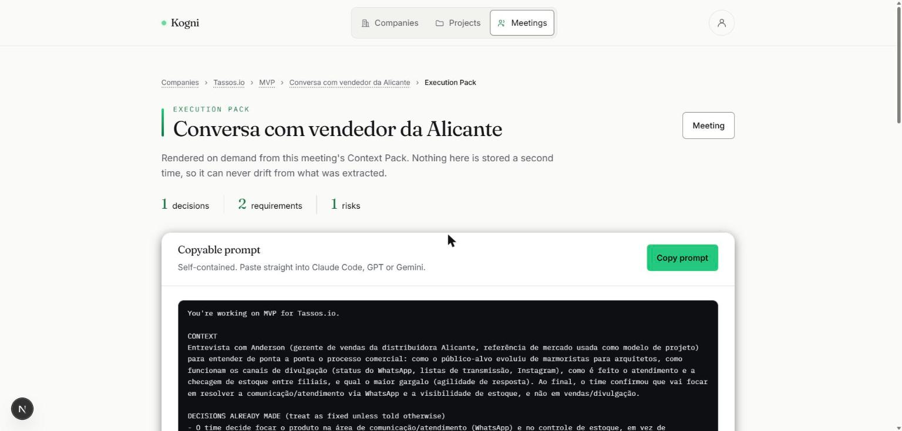
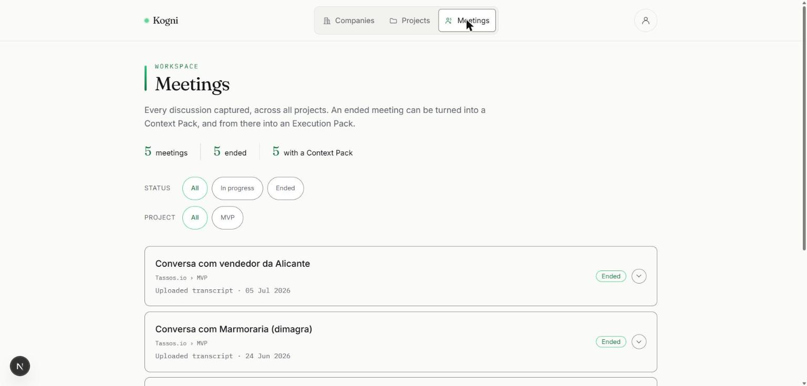

# Heitor Goulart

Estudante de Ciência da Computação no Inteli. Escrevo o produto que estou construindo.

Me interessa o problema que sobra quando a IA já sabe programar: empresas passam
o dia reconstruindo contexto que já existe. É disso que nasceu a **Kogni**.

São Paulo · [LinkedIn](https://linkedin.com/in/heitor-goulart) · heitorgoulart@icloud.com

---

## Kogni — o contexto da empresa, pronto para execução

Uma plataforma que transforma as reuniões e tarefas de uma empresa em contexto
estruturado, para que ninguém — nem a IA — precise reexplicar o projeto do zero.

O que está no ar: a empresa sobe seus documentos de contexto, cria um projeto, e
cada reunião vira um **Context Pack** (decisões, requisitos, riscos, próximos
passos) e um **Execution Pack** — contexto, decisões, requisitos e arquitetura em
arquivos, mais o prompt pronto para o agente de código executar.

*Um Execution Pack renderizado a partir de uma reunião real: decisões, requisitos e riscos extraídos, e o prompt pronto para colar no Claude Code.*

**Stack:** Next.js (App Router) · TypeScript · Tailwind · Supabase (Postgres, Auth, Storage, RLS) · API da Anthropic

**Meu papel:** cofundador, e **56 dos 69 commits do MVP são meus**. Construí o
produto trabalhando com agentes de IA — e foi exatamente essa rotina, a de
reexplicar o mesmo projeto para o modelo dez vezes por dia, que virou a Kogni.

**Uma decisão que defendo:** o app roda sem `service_role_key`. Toda query passa
pelo usuário logado e é isolada por RLS no Postgres — não existe atalho no servidor
para ler o dado de outra empresa. Numa ferramenta que guarda o contexto inteiro de
uma companhia, isso não é detalhe.

**Estágio:** MVP funcionando, em validação com founders; primeiras conversas
comerciais em andamento. <!-- TODO: quando a NG Cash fechar, o nome entra aqui -->

Código em `github.com/kogniai/kogni-mvp` — privado enquanto o produto não sai do
forno, aberto para quem pedir.

---

## Marmo — copiloto de compras para distribuidores de pedras naturais

Sugeria o cronograma de compras por filial levando em conta o lead time de
importação: o distribuidor decide *o que* e *quando* comprar sem depender do
feeling de uma pessoa. React · TypeScript · Vite · Tailwind · Three.js.

Minha primeira startup. Fui eu quem marcou as reuniões e sentou com os clientes —
a proposta de valor saiu dessas conversas, não de dentro de uma sala. Também
construí um agente de IA integrado ao WhatsApp, o canal onde esse mercado
realmente negocia.

Saí da sociedade em agosto de 2026, e o aprendizado não foi sobre o produto: foi
que escolher sócio é a decisão mais cara que um founder toma cedo, e eu escolhi
rápido demais. Na Kogni fiz diferente.

---

## Antes disso — Inteli, projetos com empresas reais

No Inteli, cada módulo é um projeto com uma empresa parceira. Os meus:

- **MAHLE** — modelo de IA para previsão de demanda, destravando a gestão de estoque de uma grande fornecedora do setor automotivo.
- **BRPEC** — software de gestão para o agronegócio: discovery com produtores rurais, modelagem de fluxos e validação com o cliente.
- **Metrô SP** — briefing real de mobilidade urbana: pesquisa com passageiros, proposta de valor e protótipo navegável.
- **STEPS / LEI** — Liga de Empreendedorismo do Inteli: trilha de formação de founders, da ideia até a primeira captação.

---

## Como eu trabalho

Trabalho em picos: quando um problema me pega, ficam horas nele até virar. Não é
rotina de horário, é constância no assunto — o produto anda porque eu volto nele,
não porque a agenda mandou.

Penso conversando. Levanto três caminhos antes de defender um, e prefiro alguém
que discorde de mim a alguém que concorde rápido — é assim que a solução melhora.
Em compensação, o que me custa é a parte depois que o problema já foi resolvido.
Sei o tipo de sócio que me complementa, e isso me custou uma sociedade para
aprender.
